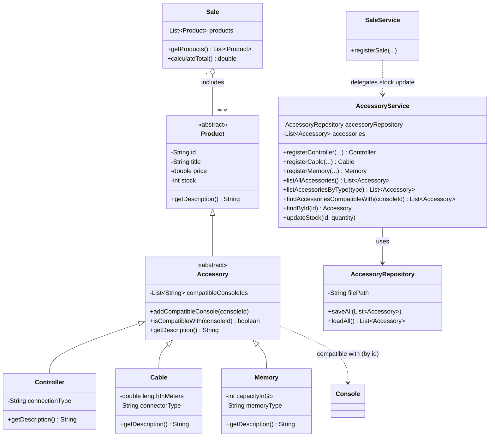

# Accessory Module — Class Diagram

```mermaid
classDiagram
    class Product {
        <<abstract>>
        -String id
        -String title
        -double price
        -int stock
        +getDescription() String
    }

    class Accessory {
        <<abstract>>
        -List~String~ compatibleConsoleIds
        +addCompatibleConsole(consoleId)
        +isCompatibleWith(consoleId) boolean
        +getDescription() String
    }

    class Controller {
        -String connectionType
        +getDescription() String
    }

    class Cable {
        -double lengthInMeters
        -String connectorType
        +getDescription() String
    }

    class Memory {
        -int capacityInGb
        -String memoryType
        +getDescription() String
    }

    class AccessoryRepository {
        -String filePath
        +saveAll(List~Accessory~)
        +loadAll() List~Accessory~
    }

    class AccessoryService {
        -AccessoryRepository accessoryRepository
        -List~Accessory~ accessories
        +registerController(...) Controller
        +registerCable(...) Cable
        +registerMemory(...) Memory
        +listAllAccessories() List~Accessory~
        +listAccessoriesByType(type) List~Accessory~
        +findAccessoriesCompatibleWith(consoleId) List~Accessory~
        +findById(id) Accessory
        +updateStock(id, quantity)
    }

    class Sale {
        -List~Product~ products
        +getProducts() List~Product~
        +calculateTotal() double
    }

    class SaleService {
        +registerSale(...)
    }

    class Console

    Product <|-- Accessory
    Accessory <|-- Controller
    Accessory <|-- Cable
    Accessory <|-- Memory
    AccessoryService --> AccessoryRepository : uses
    Sale "1" o-- "many" Product : includes
    SaleService ..> AccessoryService : delegates stock update
    Accessory ..> Console : compatible with (by id)
```
