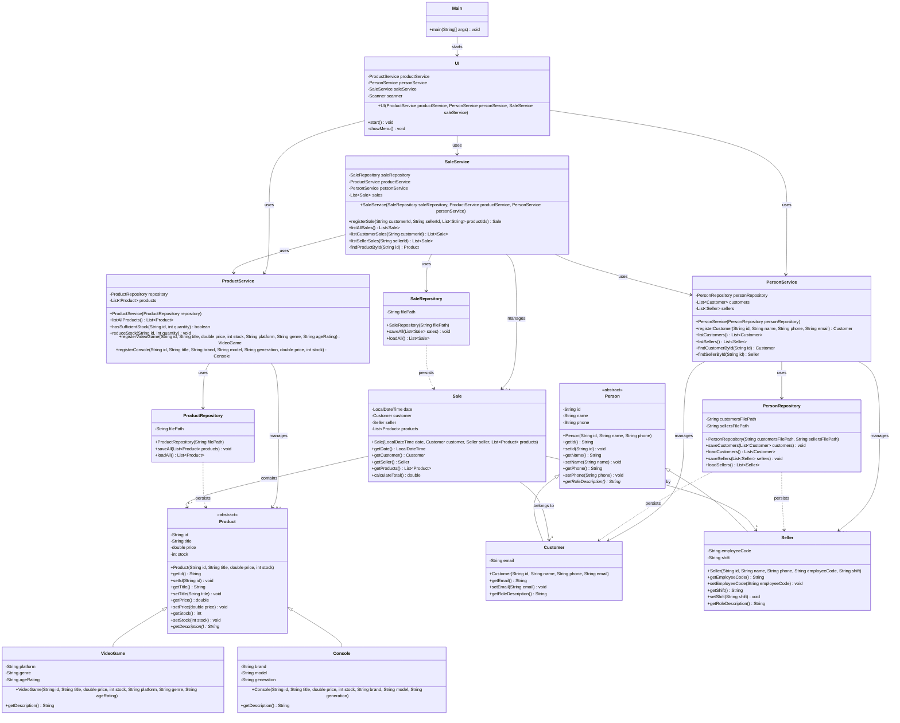

# Class Diagram

The following diagram represents the class structure of the GameZone Unicesar system, including the model, persistence, service, and user interface layers.

```mermaid
classDiagram

    %% ==================================================
    %% MODEL LAYER
    %% ==================================================

    class Product {
        <<abstract>>
        -String id
        -String title
        -double price
        -int stock
        +Product(String id, String title, double price, int stock)
        +getId() String
        +setId(String id) void
        +getTitle() String
        +setTitle(String title) void
        +getPrice() double
        +setPrice(double price) void
        +getStock() int
        +setStock(int stock) void
        +getDescription()* String
    }

    class VideoGame {
        -String platform
        -String genre
        -String ageRating
        +VideoGame(String id, String title, double price, int stock, String platform, String genre, String ageRating)
        +getDescription() String
    }

    class Console {
        -String brand
        -String model
        -String generation
        +Console(String id, String title, double price, int stock, String brand, String model, String generation)
        +getDescription() String
    }

    class Person {
        <<abstract>>
        -String id
        -String name
        -String phone
        +Person(String id, String name, String phone)
        +getId() String
        +setId(String id) void
        +getName() String
        +setName(String name) void
        +getPhone() String
        +setPhone(String phone) void
        +getRoleDescription()* String
    }

    class Customer {
        -String email
        +Customer(String id, String name, String phone, String email)
        +getEmail() String
        +setEmail(String email) void
        +getRoleDescription() String
    }

    class Seller {
        -String employeeCode
        -String shift
        +Seller(String id, String name, String phone, String employeeCode, String shift)
        +getEmployeeCode() String
        +setEmployeeCode(String employeeCode) void
        +getShift() String
        +setShift(String shift) void
        +getRoleDescription() String
    }

    class Sale {
        -LocalDateTime date
        -Customer customer
        -Seller seller
        -List~Product~ products
        +Sale(LocalDateTime date, Customer customer, Seller seller, List~Product~ products)
        +getDate() LocalDateTime
        +getCustomer() Customer
        +getSeller() Seller
        +getProducts() List~Product~
        +calculateTotal() double
    }

    Product <|-- VideoGame
    Product <|-- Console

    Person <|-- Customer
    Person <|-- Seller

    Sale --> "1" Customer : belongs to
    Sale --> "1" Seller : attended by
    Sale --> "1..*" Product : contains


    %% ==================================================
    %% PERSISTENCE LAYER
    %% ==================================================

    class ProductRepository {
        -String filePath
        +ProductRepository(String filePath)
        +saveAll(List~Product~ products) void
        +loadAll() List~Product~
    }

    class PersonRepository {
        -String customersFilePath
        -String sellersFilePath
        +PersonRepository(String customersFilePath, String sellersFilePath)
        +saveCustomers(List~Customer~ customers) void
        +loadCustomers() List~Customer~
        +saveSellers(List~Seller~ sellers) void
        +loadSellers() List~Seller~
    }

    class SaleRepository {
        -String filePath
        +SaleRepository(String filePath)
        +saveAll(List~Sale~ sales) void
        +loadAll() List~Sale~
    }

    ProductRepository ..> Product : persists
    PersonRepository ..> Customer : persists
    PersonRepository ..> Seller : persists
    SaleRepository ..> Sale : persists


    %% ==================================================
    %% SERVICE LAYER
    %% ==================================================

    class ProductService {
        -ProductRepository repository
        -List~Product~ products
        +ProductService(ProductRepository repository)
        +listAllProducts() List~Product~
        +hasSufficientStock(String id, int quantity) boolean
        +reduceStock(String id, int quantity) void
        +registerVideoGame(String id, String title, double price, int stock, String platform, String genre, String ageRating) VideoGame
        +registerConsole(String id, String title, String brand, String model, String generation, double price, int stock) Console
    }

    class PersonService {
        -PersonRepository personRepository
        -List~Customer~ customers
        -List~Seller~ sellers
        +PersonService(PersonRepository personRepository)
        +registerCustomer(String id, String name, String phone, String email) Customer
        +listCustomers() List~Customer~
        +listSellers() List~Seller~
        +findCustomerById(String id) Customer
        +findSellerById(String id) Seller
    }

    class SaleService {
        -SaleRepository saleRepository
        -ProductService productService
        -PersonService personService
        -List~Sale~ sales
        +SaleService(SaleRepository saleRepository, ProductService productService, PersonService personService)
        +registerSale(String customerId, String sellerId, List~String~ productIds) Sale
        +listAllSales() List~Sale~
        +listCustomerSales(String customerId) List~Sale~
        +listSellerSales(String sellerId) List~Sale~
        -findProductById(String id) Product
    }

    ProductService --> ProductRepository : uses
    ProductService --> "0..*" Product : manages

    PersonService --> PersonRepository : uses
    PersonService --> "0..*" Customer : manages
    PersonService --> "0..*" Seller : manages

    SaleService --> SaleRepository : uses
    SaleService --> "0..*" Sale : manages
    SaleService --> ProductService : uses
    SaleService --> PersonService : uses


    %% ==================================================
    %% USER INTERFACE LAYER
    %% ==================================================

    class UI {
        -ProductService productService
        -PersonService personService
        -SaleService saleService
        -Scanner scanner
        +UI(ProductService productService, PersonService personService, SaleService saleService)
        +start() void
        -showMenu() void
    }

    UI --> ProductService : uses
    UI --> PersonService : uses
    UI --> SaleService : uses


    %% ==================================================
    %% APPLICATION ENTRY POINT
    %% ==================================================

    class Main {
        +main(String[] args) void
    }

    Main --> UI : starts
```
