# Integrated Class Diagram

The following diagram represents the integrated GameZone Unicesar system after combining the product, accessory, promotion, warranty, sale, and return modules.

```mermaid
classDiagram

    %% ==================================================
    %% MODEL LAYER
    %% ==================================================

    class Product {
        <<abstract>>
        -String id
        -String title
        -double price
        -int stock
        +getId() String
        +getTitle() String
        +getPrice() double
        +getStock() int
        +setStock(int stock) void
        +getDescription()* String
    }

    class VideoGame {
        -String platform
        -String genre
        -String ageRating
        +getDescription() String
    }

    class Console {
        -String brand
        -String model
        -String generation
        +getDescription() String
    }

    class Accessory {
        <<abstract>>
        -List~String~ compatibleConsoleIds
        +getCompatibleConsoleIds() List~String~
        +addCompatibleConsole(String consoleId) void
        +removeCompatibleConsole(String consoleId) void
        +isCompatibleWith(String consoleId) boolean
        +getDescription() String
    }

    class Controller {
        -String connectionType
        +getDescription() String
    }

    class Cable {
        -double lengthInMeters
        -String connectorType
        +getDescription() String
    }

    class Memory {
        -int capacityInGigabytes
        -String memoryType
        +getDescription() String
    }

    class Person {
        <<abstract>>
        -String id
        -String name
        -String phone
        +getId() String
        +getName() String
        +getPhone() String
        +getRoleDescription()* String
    }

    class Customer {
        -String email
        +getEmail() String
        +getRoleDescription() String
    }

    class Seller {
        -String employeeCode
        -String shift
        +getEmployeeCode() String
        +getShift() String
        +getRoleDescription() String
    }

    class Sale {
        -LocalDateTime date
        -Customer customer
        -Seller seller
        -List~Product~ products
        -String appliedPromotionName
        -double discountAmount
        -double extendedWarrantyCost
        +getDate() LocalDateTime
        +getCustomer() Customer
        +getSeller() Seller
        +getProducts() List~Product~
        +getDiscountAmount() double
        +getExtendedWarrantyCost() double
        +calculateTotal() double
        +calculateFinalTotal() double
        +generateReceipt() String
        +canBeReturned() boolean
    }

    class Promotion {
        <<abstract>>
        -String id
        -String name
        -LocalDate startDate
        -LocalDate endDate
        +isActive(LocalDate date) boolean
        +calculateDiscount(Sale sale)* double
    }

    class PercentageDiscount {
        -double percentage
        +calculateDiscount(Sale sale) double
    }

    class CategoryDiscount {
        -double percentage
        -String targetCategory
        +calculateDiscount(Sale sale) double
    }

    class BulkPurchaseDiscount {
        -int minimumQuantity
        -double percentage
        +calculateDiscount(Sale sale) double
    }

    class Warranty {
        <<abstract>>
        -String id
        -Product product
        -Sale sale
        -LocalDate startDate
        -LocalDate endDate
        +getId() String
        +getProduct() Product
        +getSale() Sale
        +getStartDate() LocalDate
        +getEndDate() LocalDate
        +getDurationInMonths()* int
        +getWarrantyType()* String
        +getAdditionalCost()* double
        +isActive(LocalDate date) boolean
        +generateWarrantyCertificate() String
    }

    class BasicWarranty {
        +getDurationInMonths() int
        +getWarrantyType() String
        +getAdditionalCost() double
    }

    class ExtendedWarranty {
        -double COST_PERCENTAGE
        +getDurationInMonths() int
        +getWarrantyType() String
        +getAdditionalCost() double
    }

    class Return {
        -String id
        -LocalDate date
        -Sale sale
        -List~Product~ returnedProducts
        -String reason
        -double refundAmount
        -double warrantyRefundAmount
        +getId() String
        +getDate() LocalDate
        +getSale() Sale
        +getReturnedProducts() List~Product~
        +getReason() String
        +getRefundAmount() double
        +getWarrantyRefundAmount() double
        +calculateRefundAmount() double
        +addWarrantyRefund(double amount) void
        +generateReturnReceipt() String
    }

    Product <|-- VideoGame
    Product <|-- Console
    Product <|-- Accessory

    Accessory <|-- Controller
    Accessory <|-- Cable
    Accessory <|-- Memory

    Person <|-- Customer
    Person <|-- Seller

    Promotion <|-- PercentageDiscount
    Promotion <|-- CategoryDiscount
    Promotion <|-- BulkPurchaseDiscount

    Warranty <|-- BasicWarranty
    Warranty <|-- ExtendedWarranty

    Sale "1" --> "1" Customer : purchased by
    Sale "1" --> "1" Seller : attended by
    Sale "1" o-- "1..*" Product : contains

    Warranty "many" --> "1" Product : covers
    Warranty "many" --> "1" Sale : belongs to

    Return "many" --> "1" Sale : references
    Return "1" o-- "1..*" Product : returns


    %% ==================================================
    %% PERSISTENCE LAYER
    %% ==================================================

    class ProductRepository {
        -String filePath
        +saveAll(List~Product~ products) void
        +loadAll() List~Product~
    }

    class PersonRepository {
        -String customersFilePath
        -String sellersFilePath
        +saveCustomers(List~Customer~ customers) void
        +loadCustomers() List~Customer~
        +saveSellers(List~Seller~ sellers) void
        +loadSellers() List~Seller~
    }

    class AccessoryRepository {
        -String filePath
        +saveAll(List~Accessory~ accessories) void
        +loadAll() List~Accessory~
    }

    class PromotionRepository {
        -String filePath
        +saveAll(List~Promotion~ promotions) void
        +loadAll() List~Promotion~
    }

    class SaleRepository {
        -String filePath
        +saveAll(List~Sale~ sales) void
        +loadAll() List~Sale~
    }

    class WarrantyRepository {
        -String filePath
        +saveAll(List~Warranty~ warranties) void
        +loadAll() List~WarrantyRecord~
    }

    class ReturnRepository {
        -String filePath
        -SaleRepository saleRepository
        -ProductService productService
        -AccessoryService accessoryService
        +saveAll(List~Return~ returns) void
        +loadAll() List~Return~
    }

    ProductRepository ..> Product : persists
    PersonRepository ..> Customer : persists
    PersonRepository ..> Seller : persists
    AccessoryRepository ..> Accessory : persists
    PromotionRepository ..> Promotion : persists
    SaleRepository ..> Sale : persists
    WarrantyRepository ..> Warranty : persists
    ReturnRepository ..> Return : persists
    ReturnRepository --> SaleRepository : resolves sales
    ReturnRepository --> ProductService : resolves products
    ReturnRepository --> AccessoryService : resolves accessories


    %% ==================================================
    %% SERVICE LAYER
    %% ==================================================

    class ProductService {
        -ProductRepository repository
        -List~Product~ products
        +listAllProducts() List~Product~
        +hasSufficientStock(String id, int quantity) boolean
        +reduceStock(String id, int quantity) void
        +restoreStock(String id, int quantity) void
        +registerVideoGame(...) VideoGame
        +registerConsole(...) Console
    }

    class PersonService {
        -PersonRepository personRepository
        -List~Customer~ customers
        -List~Seller~ sellers
        +registerCustomer(...) Customer
        +listCustomers() List~Customer~
        +listSellers() List~Seller~
        +findCustomerById(String id) Customer
        +findSellerById(String id) Seller
    }

    class AccessoryService {
        -AccessoryRepository accessoryRepository
        -List~Accessory~ accessories
        +registerController(...) Controller
        +registerCable(...) Cable
        +registerMemory(...) Memory
        +listAllAccessories() List~Accessory~
        +listAccessoriesByType(String type) List~Accessory~
        +findAccessoriesCompatibleWith(String consoleId) List~Accessory~
        +findById(String id) Accessory
        +updateStock(String accessoryId, int quantity) void
        +restoreStock(String accessoryId, int quantity) void
    }

    class PromotionService {
        -PromotionRepository promotionRepository
        -List~Promotion~ promotions
        +registerPercentageDiscount(...) PercentageDiscount
        +registerCategoryDiscount(...) CategoryDiscount
        +registerBulkPurchaseDiscount(...) BulkPurchaseDiscount
        +listAllPromotions() List~Promotion~
        +listActivePromotions() List~Promotion~
        +findBestPromotionFor(Sale sale) Promotion
        +findById(String id) Promotion
    }

    class WarrantyService {
        -WarrantyRepository warrantyRepository
        -SaleRepository saleRepository
        -ProductService productService
        -List~Warranty~ warranties
        +assignBasicWarranty(...) BasicWarranty
        +assignExtendedWarranty(...) ExtendedWarranty
        +findWarrantyByProduct(...) Warranty
        +listAllWarranties() List~Warranty~
        +listActiveWarranties() List~Warranty~
        +listWarrantiesExpiringSoon(int daysAhead) List~Warranty~
        +cancelWarranties(String productId, String saleId) double
    }

    class SaleService {
        -SaleRepository saleRepository
        -ProductService productService
        -PersonService personService
        -AccessoryService accessoryService
        -PromotionService promotionService
        -WarrantyService warrantyService
        -List~Sale~ sales
        +registerSale(...) Sale
        +listAllSales() List~Sale~
        +listCustomerSales(String customerId) List~Sale~
        +listSellerSales(String sellerId) List~Sale~
    }

    class ReturnService {
        -ReturnRepository returnRepository
        -SaleService saleService
        -ProductService productService
        -AccessoryService accessoryService
        -WarrantyService warrantyService
        -List~Return~ returns
        +registerReturn(String saleId, List~String~ productIds, String reason) Return
        +viewAllReturns() List~Return~
        +viewReturnsByCustomer(String customerId) List~Return~
        +viewReturnsBySale(String saleId) List~Return~
        +calculateMonthlySales(int month, int year) double
        +calculateMonthlyReturns(int month, int year) double
        +generateMonthlyBalance(int month, int year) double
    }

    ProductService --> ProductRepository : uses
    ProductService --> "0..*" Product : manages

    PersonService --> PersonRepository : uses
    PersonService --> "0..*" Customer : manages
    PersonService --> "0..*" Seller : manages

    AccessoryService --> AccessoryRepository : uses
    AccessoryService --> "0..*" Accessory : manages

    PromotionService --> PromotionRepository : uses
    PromotionService --> "0..*" Promotion : manages

    WarrantyService --> WarrantyRepository : uses
    WarrantyService --> SaleRepository : resolves sales
    WarrantyService --> ProductService : resolves products
    WarrantyService --> "0..*" Warranty : manages

    SaleService --> SaleRepository : uses
    SaleService --> ProductService : uses
    SaleService --> PersonService : uses
    SaleService --> AccessoryService : uses
    SaleService --> PromotionService : uses
    SaleService --> WarrantyService : uses
    SaleService --> "0..*" Sale : manages

    ReturnService --> ReturnRepository : uses
    ReturnService --> SaleService : uses
    ReturnService --> ProductService : restores products
    ReturnService --> AccessoryService : restores accessories
    ReturnService --> WarrantyService : cancels warranties
    ReturnService --> "0..*" Return : manages


    %% ==================================================
    %% USER INTERFACE LAYER
    %% ==================================================

    class UI {
        -PersonService personService
        -ProductService productService
        -AccessoryService accessoryService
        -SaleService saleService
        -Scanner scanner
        +start() void
    }

    UI --> PersonService : uses
    UI --> ProductService : uses
    UI --> AccessoryService : uses
    UI --> SaleService : uses


    %% ==================================================
    %% APPLICATION ENTRY POINT
    %% ==================================================

    class Main {
        +main(String[] args) void
    }

    Main --> UI : starts
```

## Integration notes

- `Product` is the common hierarchy for video games, consoles, and accessories.
- `Accessory` extends `Product` and is specialized into controllers, cables, and memories.
- `Promotion` is polymorphic and supports percentage, category, and bulk-purchase discounts.
- `SaleService` coordinates products, accessories, customers, sellers, promotions, and warranties during sale registration.
- `WarrantyRepository` stores raw warranty data without depending on `SaleService`, which removes the circular dependency addressed by A2.
- `ReturnService` coordinates partial returns, inventory restoration, warranty cancellation, and monthly reporting.
- `ReturnRepository` resolves returned products from both `ProductService` and `AccessoryService`.
- The current console interface is implemented by `UI`. The return, warranty, and monthly balance services are part of the integrated service layer and are ready for the remaining application-level wiring assigned to the Technical Leader.