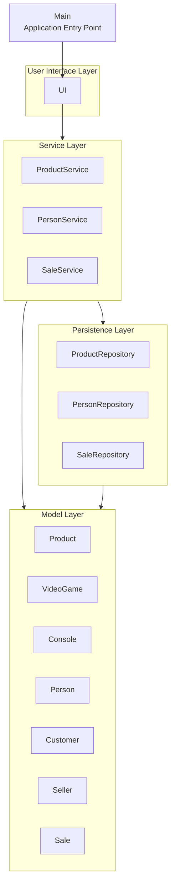

# Layers Diagram

The following diagram represents the four architectural layers of the GameZone Unicesar system, the classes belonging to each layer, and the allowed dependencies between layers.

```mermaid
flowchart TD

    %% ==========================================
    %% APPLICATION ENTRY POINT
    %% ==========================================

    Main["Main<br/>Application Entry Point"]

    %% ==========================================
    %% USER INTERFACE LAYER
    %% ==========================================

    subgraph UI["User Interface Layer"]
        UIClass["UI"]
    end

    %% ==========================================
    %% SERVICE LAYER
    %% ==========================================

    subgraph SERVICE["Service Layer"]
        ProductService["ProductService"]
        PersonService["PersonService"]
        SaleService["SaleService"]
    end

    %% ==========================================
    %% PERSISTENCE LAYER
    %% ==========================================

    subgraph PERSISTENCE["Persistence Layer"]
        ProductRepository["ProductRepository"]
        PersonRepository["PersonRepository"]
        SaleRepository["SaleRepository"]
    end

    %% ==========================================
    %% MODEL LAYER
    %% ==========================================

    subgraph MODEL["Model Layer"]
        Product["Product"]
        VideoGame["VideoGame"]
        Console["Console"]
        Person["Person"]
        Customer["Customer"]
        Seller["Seller"]
        Sale["Sale"]
    end

    %% ==========================================
    %% APPLICATION STARTUP
    %% ==========================================

    Main --> UIClass

    %% ==========================================
    %% ALLOWED LAYER DEPENDENCIES
    %% ==========================================

    UIClass --> SERVICE

    SERVICE --> PERSISTENCE
    SERVICE --> MODEL

    PERSISTENCE --> MODEL
```
