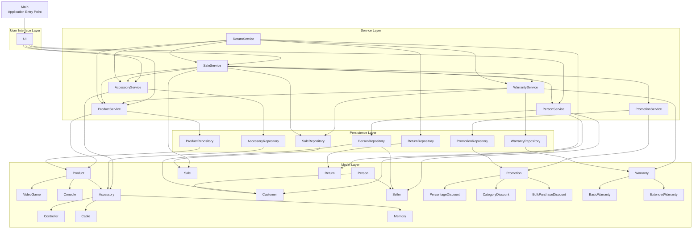

# Integrated Layers Diagram

The following diagram represents the four architectural layers of the integrated GameZone Unicesar system and the dependencies between them.



## Dependency rules

The project preserves the following architectural direction:

```text
UI → Service → Persistence
       ↓
      Model
```

The service layer may also coordinate other services when business rules require collaboration between modules.

The integrated system uses this coordination in particular for:

- `SaleService`, which coordinates products, accessories, people, promotions, and warranties.
- `WarrantyService`, which resolves sales through `SaleRepository` and products through `ProductService`.
- `ReturnService`, which coordinates returns, inventory restoration, and warranty cancellation.
- `ReturnRepository`, which resolves returned items through both `ProductService` and `AccessoryService`.

The model layer does not contain file access logic, and persistence responsibilities remain isolated in the repository layer.