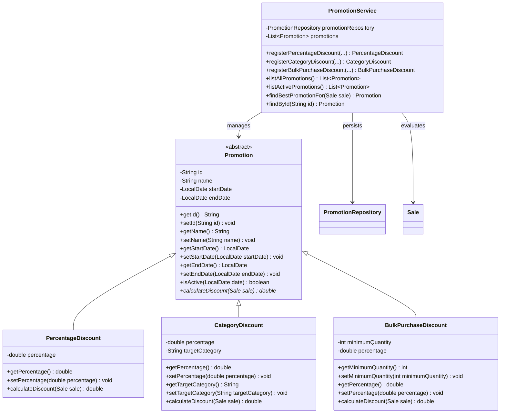

# Promotion Class Diagram

```mermaid
classDiagram

    class Promotion {
        <<abstract>>
        -String id
        -String name
        -LocalDate startDate
        -LocalDate endDate
        +getId() String
        +setId(String id) void
        +getName() String
        +setName(String name) void
        +getStartDate() LocalDate
        +setStartDate(LocalDate startDate) void
        +getEndDate() LocalDate
        +setEndDate(LocalDate endDate) void
        +isActive(LocalDate date) boolean
        +calculateDiscount(Sale sale)* double
    }

    class PercentageDiscount {
        -double percentage
        +getPercentage() double
        +setPercentage(double percentage) void
        +calculateDiscount(Sale sale) double
    }

    class CategoryDiscount {
        -double percentage
        -String targetCategory
        +getPercentage() double
        +setPercentage(double percentage) void
        +getTargetCategory() String
        +setTargetCategory(String targetCategory) void
        +calculateDiscount(Sale sale) double
    }

    class BulkPurchaseDiscount {
        -int minimumQuantity
        -double percentage
        +getMinimumQuantity() int
        +setMinimumQuantity(int minimumQuantity) void
        +getPercentage() double
        +setPercentage(double percentage) void
        +calculateDiscount(Sale sale) double
    }

    class PromotionService {
        -PromotionRepository promotionRepository
        -List~Promotion~ promotions
        +registerPercentageDiscount(...) PercentageDiscount
        +registerCategoryDiscount(...) CategoryDiscount
        +registerBulkPurchaseDiscount(...) BulkPurchaseDiscount
        +listAllPromotions() List~Promotion~
        +listActivePromotions() List~Promotion~
        +findBestPromotionFor(Sale sale) Promotion
        +findById(String id) Promotion
    }

    class PromotionRepository

    class Sale

    Promotion <|-- PercentageDiscount
    Promotion <|-- CategoryDiscount
    Promotion <|-- BulkPurchaseDiscount

    PromotionService --> PromotionRepository : persists
    PromotionService --> Promotion : manages
    PromotionService --> Sale : evaluates
```