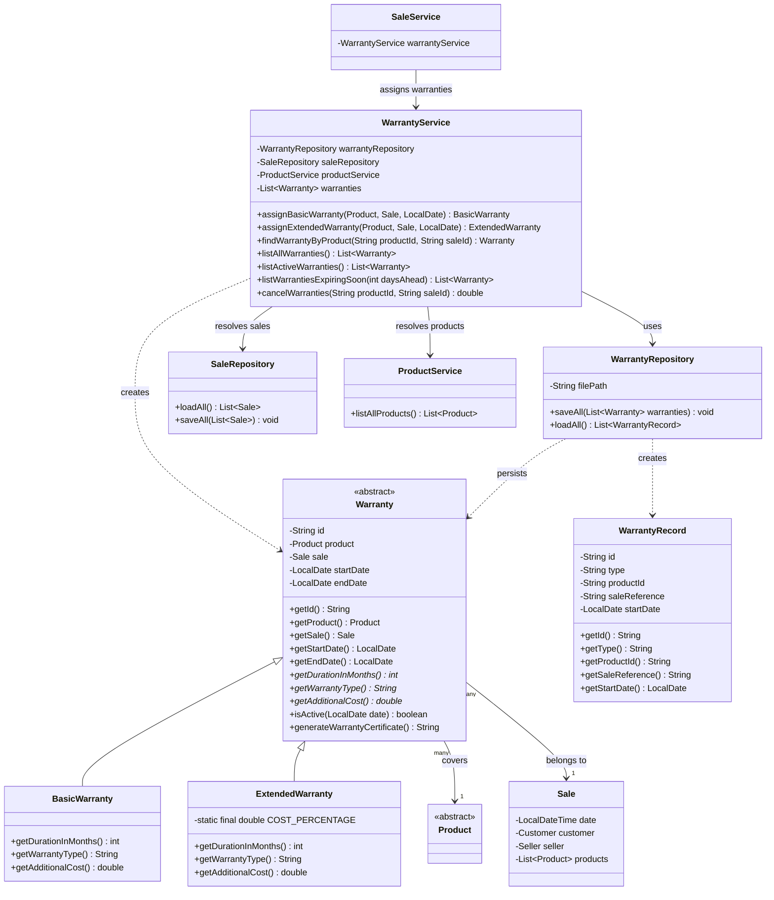

# Warranty Module - Class Diagram

This diagram reflects the warranty module as implemented, including
the A2 integration adjustment that removes the circular dependency
between `SaleService`, `WarrantyService` and `WarrantyRepository`.

The repository stores raw warranty data and does not resolve `Sale`
or `Product` references. `WarrantyService` is responsible for resolving
those references through `SaleRepository` and `ProductService`.

## Key design notes

- `Warranty` is abstract and stores the common warranty information:
  product, sale, start date and end date. Duration, warranty type and
  additional cost are resolved polymorphically by the concrete warranty
  classes.

- `BasicWarranty` provides 6 months of coverage with no additional cost.

- `ExtendedWarranty` provides 12 months of coverage and calculates an
  additional cost equal to 10% of the covered product price.

- `WarrantyRepository` is responsible only for reading and writing
  raw warranty data. It does not depend on `SaleService`,
  `SaleRepository` or `ProductService`.

- `WarrantyRepository.loadAll()` returns `WarrantyRecord` objects
  containing raw identifiers. `WarrantyService` resolves the referenced
  sales and products and reconstructs the corresponding warranty objects.

- `WarrantyService` depends directly on `SaleRepository` and
  `ProductService` to resolve references. This design avoids the
  circular dependency that would occur if `WarrantyRepository`
  depended on `SaleService`, while `SaleService` also depended on
  `WarrantyService`.

- `WarrantyService.cancelWarranties(...)` removes the warranties
  associated with a returned console and returns the refundable
  additional warranty cost.

- `SaleService` uses `WarrantyService` during sale registration to
  assign the basic warranty and any requested extended warranty.