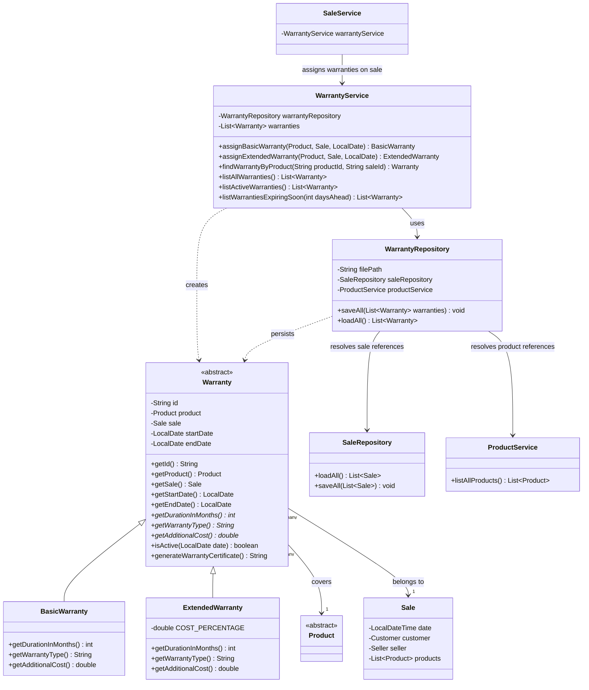

# Warranty Module - Class Diagram

This diagram reflects the warranty module as implemented, including the
fix applied by the `fix/warranty-circular-dependency` integration
adjustment (A2): `WarrantyRepository` resolves sale references through
`SaleRepository` instead of `SaleService`, avoiding the circular
dependency `SaleService -> WarrantyService -> WarrantyRepository ->
SaleService` that the original Requirement 4 design would have produced.

## Key design notes

- `Warranty` is abstract and stores only common attributes (id, product,
  sale, start/end date); duration, type and additional cost are resolved
  polymorphically through abstract methods implemented by
  `BasicWarranty` and `ExtendedWarranty`.
- `Sale` currently has no unique identifier of its own. Both
  `WarrantyRepository` (when persisting/loading) and `WarrantyService`
  (when looking up a warranty by sale) identify a sale using a composite
  reference built from `sale.getDate()` and `sale.getCustomer().getId()`.
- `WarrantyRepository` depends on `SaleRepository` and `ProductService`
  only, never on `SaleService`. This is the fix applied by the A2
  integration adjustment: the original Requirement 4 design would have
  had `WarrantyRepository` depend on `SaleService`, creating a circular
  dependency with `SaleService` (which itself needs `WarrantyService` to
  assign warranties during `registerSale`).
- `Main` constructs the objects in this order: repositories, then
  `ProductService`/`PersonService`, then `SaleService`, then
  `WarrantyRepository` (using `SaleRepository` directly), then
  `WarrantyService`. This order is only possible because the circular
  dependency was removed.
